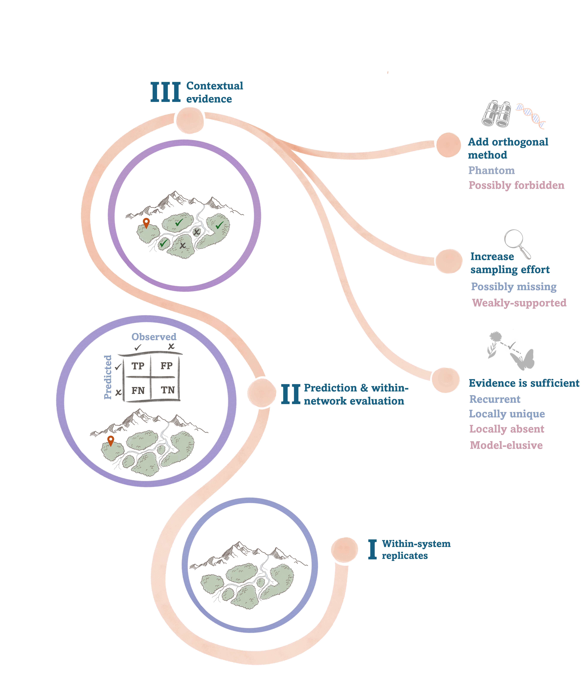

# :wave: About
This repository contains the code and data for the paper: "Contextual evidence classifies ecological interactions and guides their chase".

# :page_facing_up: Paper and citing
Abramov, K., Nehoray, S. M., Puzis, R., & Pilosof, S. (2026). **Contextual evidence classifies ecological interactions and guides their chase**. 

# Abstract:
A surge of recent methods tackles incomplete ecological interaction data through link prediction. Yet the same data gaps that motivate prediction also obscure how reliable these predictions are. Finding evidence for their existence means going to the field to verify an immense number of potential interactions, possibly with a sampling method poorly suited to the task, or searching for evidence in external sources alien to the system's ecological context. We present an actionable framework that draws on several dimensions of evidence, combining the guidance of link prediction and within-system variability as contextual evidence, to generate a fine-tuned, ecologically aware link taxonomy. This taxonomy pinpoints the most probable holes in a network and directs targeted, cost-efficient discovery actions, while increasing our confidence in predictions.

# :computer: Code:
Instructions for running the code and reproducing the results are in the repository Wiki under ["Code"](https://github.com/Ecological-Complexity-Lab/LP_validation/wiki/Code).

# :file_cabinet: Data:
Detailed in the repository Wiki under ["Data"](https://github.com/Ecological-Complexity-Lab/LP_validation/wiki/Data).
